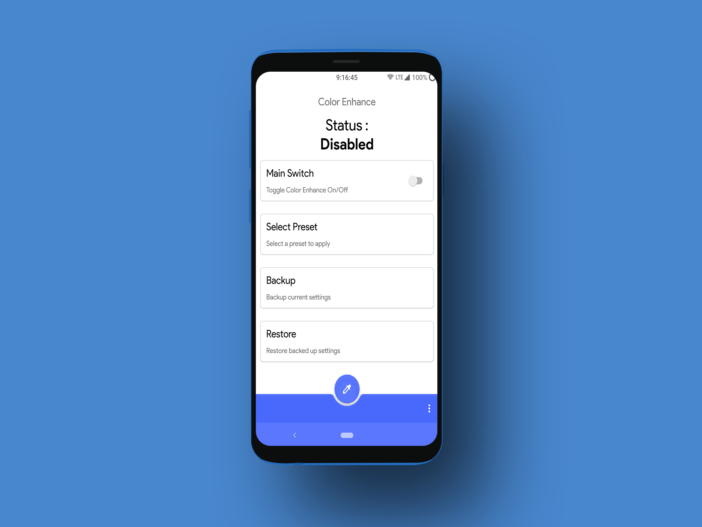
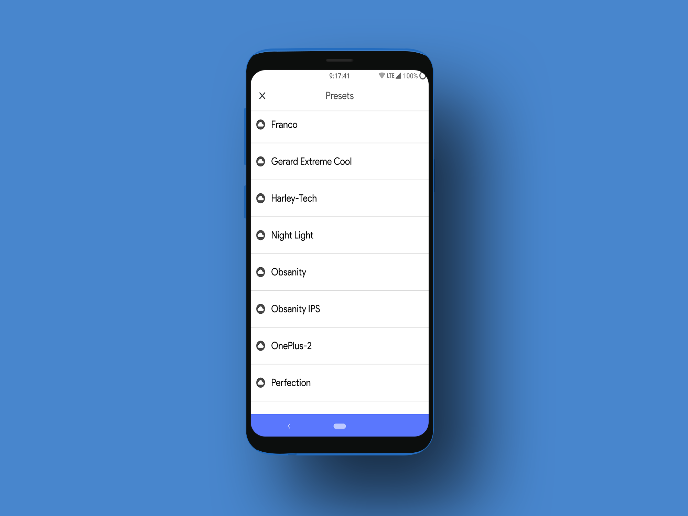
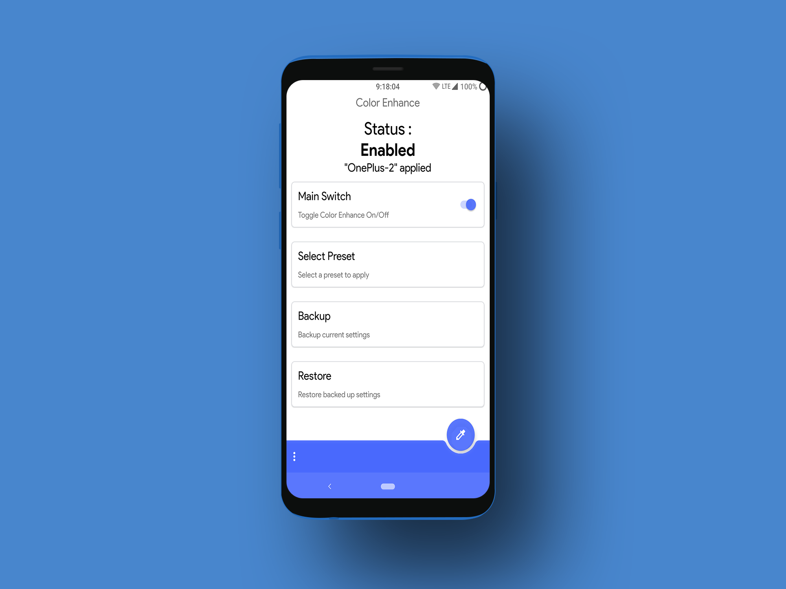

# Color Enhance

Enhance colors of your Android Phone with Color Enhance.

### Prerequisites

```
Root
```

```
Kernel with KCAL support
```

### How to use

Select any preset and apply by tapping on the bottom right button.

It can be enabled/disabled any time by the Main switch.

(After rebooting your phone, the colors are set back to normal)

So you can also set it to automatically apply after every reboot.

  


## Download

* [Bitbucket](https://bitbucket.org/ab5olute_zero/color-enhance/downloads/Color%20Enhance.apk)

### Note

It might not work on some devices (Devices different KCAL implementation).


## Author

* **Shahnawaz Ansari** - [AbsoluteZero](https://bitbucket.org/ab5olute_zero/)

## License

This project is licensed under the MIT License.

## Acknowledgments

* [savoca](https://forum.xda-developers.com/android/software-hacking/dev-kcal-advanced-color-control-t3032080)
* [corphish](https://github.com/corphish/NightLight)